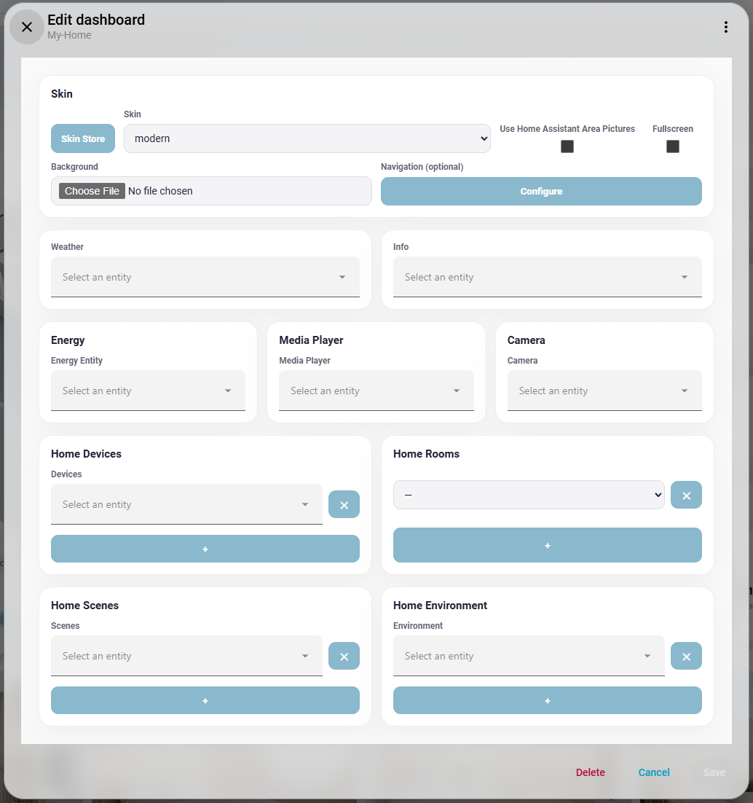

# Skins Pro — **Next-Gen Home Assistant Dashboard**

[中文版本](README.zh-CN.md)

**Next-Gen Home Assistant Dashboard** — Multi-skin, immersive, plug-and-play.

Skins Pro is a community Lovelace card with a multi-skin architecture featuring **modern**, **AEON**, **AEON_glass**, **visionOS**, and **minecraft** skins. Bilingual (CN/EN) — install from HACS and it just works.

- Add via HACS custom repository
- Switch between skins freely
- Fullscreen Kiosk mode for immersive experience
- Auto image processing on build (resize, JPG convert)
- Area-based room display
- Auto icon matching by entity domain

> Note — All current theme image assets are AI-generated, so some images may contain AI watermarks or similar generation artifacts. If you don't like the AI-generated images, you can freely upload your own background and room images in the settings.

## Philosophy

Keep it simple, keep it easy.

Skins Pro is built around simplicity and ease of use. Install from HACS, pick a skin, adjust a few settings in the card editor, and you're done. Every feature is designed to be intuitive, so you can focus on enjoying your smart home.

## Installation

[](https://my.home-assistant.io/redirect/hacs_repository/?owner=ha-china&repository=Skins-Pro&category=plugin)

Click the button above, or manually:

1. HACS → Custom Repositories → Add `https://github.com/ha-china/Skins-Pro`, category: Dashboard
2. Install Skins Pro
3. Refresh Home Assistant frontend
4. Settings → Dashboards → Add Dashboard → Select "Skins Pro"




## Built-in Skins

| Skin | Style | Features |
|---|---|---|
| **modern** (default) | White glassmorphism | Frosted glass, high-res images, clean blue-white palette |
| **AEON** | Dark luxury | Deep blacks, blue glow, glassmorphism, cinematic shadows |
| **visionOS** | Frosted glass | Apple VisionOS-inspired, flat glass, white text, immersive blur |
| **minecraft** | Minecraft theme | Dark textured background, warm tones, Steve avatar |

Switch via the "Skin" field in the card editor.

## Preview

| modern | AEON | visionOS | minecraft |
|---|---|---|---|
|  |  |  |  |


### Skin Switching Demo

<video src="https://github.com/ha-china/Skins-Pro/raw/master/screenshots/skin.mp4" controls width="100%" preload="metadata"></video>
[⬇ Download MP4](screenshots/skin.mp4)

## Features

- ☀️ Weather & greeting
- 💬 Info display
- 📱 Device controls (by area or by type)
- 🚪 Room snapshots
- 🎬 Scene buttons
- 🤖 Automations page
- ⚡ Energy dashboard (today vs yesterday)
- 🛡️ Security page — cameras, locks, alarm control panel (auto-detected, click to arm/disarm)
- 🎵 Media player card — album art, playback controls, volume bar
- 📷 Camera snapshot on homepage
- 🌡️ Environment sensors display
- 🌐 Auto CN/EN bilingual switching
- ↔️ Fullscreen Kiosk mode
- 🖼️ Use HA area pictures as room backgrounds
- 🎨 Custom background image upload
- 📱 Mobile responsive layout
- 🎭 Multi-skin architecture — 5 built-in skins

On first add, it automatically scans your Home Assistant and organizes content by area and device type.

## Skin Development

A skin is a folder under `skins-pro/<skin-name>/` containing images, CSS, and strings. `npm run build` auto-discovers, processes images, and generates code.

### Directory Structure

```
skins-pro/
  your-skin-name/
    theme.css               # Styles (required)
    strings.json            # Strings + icon_map (optional)
    avatar.jpg              # Avatar, recommended ≥ 300×300
    background.jpg          # Background, recommended width ≥ 2560px
    decoration.jpg          # Side decoration, recommended width ≥ 800px
    base-texture.jpg        # Base texture, recommended width ≥ 2560px
    stage-*.jpg             # Stage image, recommended width ≥ 2560px
    room-*.jpg              # Room image, recommended width ≥ 1200px
    icon-*.jpg              # Device icon, recommended longest edge ≥ 300px
```

### Image Processing on Build

| Pattern | Recommended source | Notes |
|---|---|---|
| `room-*` | width ≥ 1200px | Maintain ratio, downscale to 1200px |
| `icon-*` | longest edge ≥ 300px | Maintain ratio, downscale to 300px |
| `avatar.*` | longest edge ≥ 300px | Maintain ratio, downscale to 300px |
| `decoration.*` | width ≥ 800px | Maintain ratio, downscale to 800px |
| `background.*`, `base-*`, `stage-*` | width ≥ 2560px | Maintain ratio, downscale to 2560px |
| others | width ≥ 1200px | Maintain ratio, downscale to 1200px |

Supports PNG / JPG / BMP / WebP input, outputs JPG. Never upscales.

### theme.css

All styles are customized via CSS variables on `:host`. Each skin has its own `theme.css`. See `skins-pro/modern/theme.css` for the full variable list.

### strings.json + icon_map

```json
{
  "title_zh": "欢迎回来！",
  "title_en": "Welcome back!",
  "icon_map": {
    "light": "light",
    "switch": "switch",
    "climate": "climate",
    "media_player": "speaker",
    "lock": "lock"
  }
}
```

Maps entity domains to icon image filenames. Unmapped domains fall back automatically.

> **Best reference** — Use [`skins-pro/visionOS/`](skins-pro/visionOS/) as the starting point when creating a new skin. It has the most complete `icon_map`, `theme.css`, and icon assets.

## Development

```bash
git clone https://github.com/ha-china/Skins-Pro.git
cd Skins-Pro
npm install
npm run build       # Build
npm run watch       # Watch mode
npm run type-check  # Type check
```

Build output: `dist/`:

- `dist/skins-pro.js` — Core JS bundle
- `dist/<skin-name>/` — Per-skin assets and CSS

### Testing in HA

1. `npm run build`
2. Copy `dist/` to HA's `www/community/skins-pro/`
3. Hard refresh (Ctrl+Shift+R)

## Contributing a Skin

We welcome skin contributions! Requirements:

1. Create a folder under `skins-pro/<skin-name>/`
2. Provide `theme.css` (all styles via CSS variables)
3. Provide `strings.json` with greeting text and `icon_map`
4. Provide at least avatar, background, and decoration images
5. Add a `<skin-name>.png` screenshot in `screenshots/` (.png, 1920×1080 recommended)
6. Submit a PR to this repo

Images are auto-processed on build — no manual optimization needed.

## Credits

- Architecture inspired by [dwains-dashboard-next](https://github.com/dwainscheeren/dwains-dashboard-next)
- Design inspired by [html-card-pro Discussions](https://github.com/ha-china/html-card-pro/discussions/11)
- Kiosk mode inspired by [kiosk-mode](https://github.com/NemesisRE/kiosk-mode)
- Core rendering by [Lit](https://lit.dev/)
- Image processing by [sharp](https://sharp.pixelplumbing.com/)
- Zero runtime dependencies, lean and fast